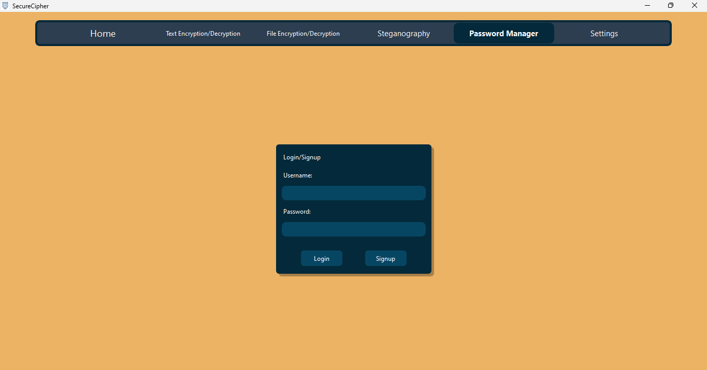

# SecureCipher

Hey there! 👋 Thanks for checking out Secure Cipher! I'm Mubashir Shaikh ,the sole developer behind this project. 
As a cybersecurity enthusiast, I wanted to create a tool that prioritizes user privacy and security. 
With Secure Cipher, you can encrypt and decrypt text/files, hide messages using steganography, and manage your passwords securely. 

Additionally, one of my primary goals in developing Secure Cipher was to make powerful encryption, steganography techniques and an in-built password manager accessible to a wider audience. While many similar tools are command-line-based and predominantly designed for Linux users, I recognized the need for a user-friendly GUI application tailored to Windows users who may not be as comfortable with technical interfaces.

With Secure Cipher, I aim to bridge the gap between robust security features and user-friendly design, ensuring that even less tech-savvy individuals can confidently protect their sensitive information. 
Happy encrypting! 🔒 

---
## Screenshots

### Dark Theme

**Home Page**

**Text Encryption/Decryption Page**

**File Encryption/Decryption Page**

**Steganography Page**

**Password Manager - Authentication Page**

**Password Manager - Vault Page**

**Light Theme**

**Text Encryption/Decryption Page**

**File Encryption/Decryption Page**

**Steganography Page**

**Password Manager - Authentication Page**

**Password Manager - Vault Page**

---

